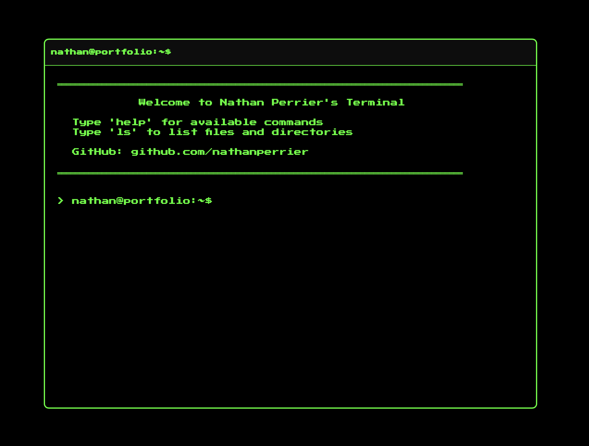

# Portfolio Terminal

A terminal-style portfolio website built with Vite and terminal.css. Navigate through my projects, skills, and experience using classic command-line interface.




## 🚀 Live Demo

Visit the live site to explore the terminal interface.

## 🛠️ Technologies Used

- **Vite** - Fast build tool and development server
- **terminal.css** - CSS framework for terminal UI styling
- **Vanilla JavaScript** - Core functionality
- **HTML5/CSS3** - Structure and styling

## 📋 Features

- **Realistic Terminal Interface** - Complete with command prompt, input field, and output display
- **Virtual File System** - Navigate through directories and read files
- **Tab Autocomplete** - Press TAB to autocomplete commands and file paths
- **Command History** - Use UP/DOWN arrows to navigate through previous commands
- **Interactive Games** - Built-in Snake game for entertainment
- **Visual Effects** - Matrix rain effect and ASCII art
- **Theme Customization** - Multiple color themes (matrix, ocean, retro, hacker)
- **System Information** - Neofetch-style system info display
- **Responsive Design** - Works on desktop and mobile devices
- **Input/Theme History** - Remembers previous history and aplies on launch

## 🗂️ File System Structure

```
/
├── about.txt           # Personal information and skills overview
├── contact.txt         # Contact details and links
├── help.txt           # List of available commands
├── projects/          # Directory containing project descriptions
│   ├── portfolio.txt  # A 3D portfolio site
│   ├── waypoint.txt   # An AR navigation web-app
│   └── MoistMeter.txt # An argicuture water saving app
└── skills/            # Directory containing skill categories
    ├── frontend.txt   # Frontend development skills
    └── backend.txt    # Backend development skills
```

## 💻 Available Commands

| Command | Description | Usage |
|---------|-------------|-------|
| `help` | Display all available commands | `help` |
| `ls` | List files and directories | `ls` or `ls projects` |
| `cat` | Display file contents | `cat about.txt` |
| `cd` | Change directory | `cd projects` or `cd ..` |
| `pwd` | Print working directory | `pwd` |
| `clear` | Clear terminal or history | `clear terminal` or `clear history` |
| `whoami` | Display current user | `whoami` |
| `date` | Show current date and time | `date` |
| `echo` | Print text to terminal | `echo Hello World` |
| `matrix.exe` | Enter the Matrix rain effect | `matrix.exe` (press Q to exit) |
| `snake.exe` | Play a classic Snake game | `snake.exe` (use arrow keys) |
| `banner` | Display ASCII art banner | `banner` |
| `neofetch` | Show system information | `neofetch` |
| `theme` | Change terminal color theme | `theme ocean` |

## 🎮 Navigation Tips

- **Tab Completion**: Start typing a command or file name and press TAB to autocomplete
- **Command History**: Use UP/DOWN arrow keys to cycle through previous commands
- **Directory Navigation**: Use `cd` to move between directories, `cd ..` to go up one level
- **File Reading**: Use `cat` followed by a filename to read any .txt file

## 🚦 Getting Started

### Prerequisites

- Node.js (v14 or higher)
- npm or yarn

### Installation

1. Clone the repository:
```bash
git clone https://github.com/nathanperrier/portfolio-terminal.git
cd portfolio-terminal
```

2. Install dependencies:
```bash
npm install
```

3. Start the development server:
```bash
npm run dev
```

4. Open your browser and navigate to the local development URL (typically http://localhost:5173)

### Building for Production

```bash
npm run build
```

The built files will be in the `dist` directory.

### Deployment

Deploy to GitHub Pages:
```bash
npm run deploy
```

## 📝 Customization

To customize the portfolio content:

1. Edit the file system structure in `src/fileSystem.json`
2. Update the text content in the JSON file
3. Add new commands in `src/commands.js`
4. Modify styles in `src/style.css`
5. Add new themes in `src/utils/theme.js`
6. Create new games in `src/games/`

## 🎨 Color Themes

### Available Themes:

**Classic Themes:**
- **matrix** (default) - Classic green on black terminal
- **ocean** - Cyan and blue ocean theme  
- **retro** - Warm retro terminal colors
- **hacker** - High contrast green theme

**Developer Themes:**
- **nes** - Nintendo Game Boy green monochrome
- **nord** - Arctic-inspired blue-grey palette
- **solarized** - Precision colors for readability
- **monokai** - Classic Sublime Text theme

**Creative Themes:**
- **cyberpunk** - Neon pink and cyan
- **forest** - Natural green tones
- **sunset** - Warm orange and red hues
- **arctic** - Light theme with cool blues
- **volcano** - Fiery orange and red
- **galaxy** - Purple and lavender space theme
- **mint** - Fresh green mint colors
- **coffee** - Warm brown coffee tones

Use `theme <name>` to switch themes. Theme preference is saved automatically.

### Default Colors:
- Background: Black (`#000`)
- Primary Text: Green (`#0f0`)
- Error Text: Red (`#f00`)
- Directory Names: Cyan (`#0ff`)
- Executable Files: Yellow (`#ff0`)

## 📄 License

This project is licensed under the MIT License - see the LICENSE file for details.

## 👤 Author

**Nathan Perrier**
- GitHub: [@nathanperrier](https://github.com/nathanperrier)
- LinkedIn: [Nathan Perrier](https://linkedin.com/in/nathanperrier23)
- Email: contact@nathanperrier.dev

---

Built with terminal.css